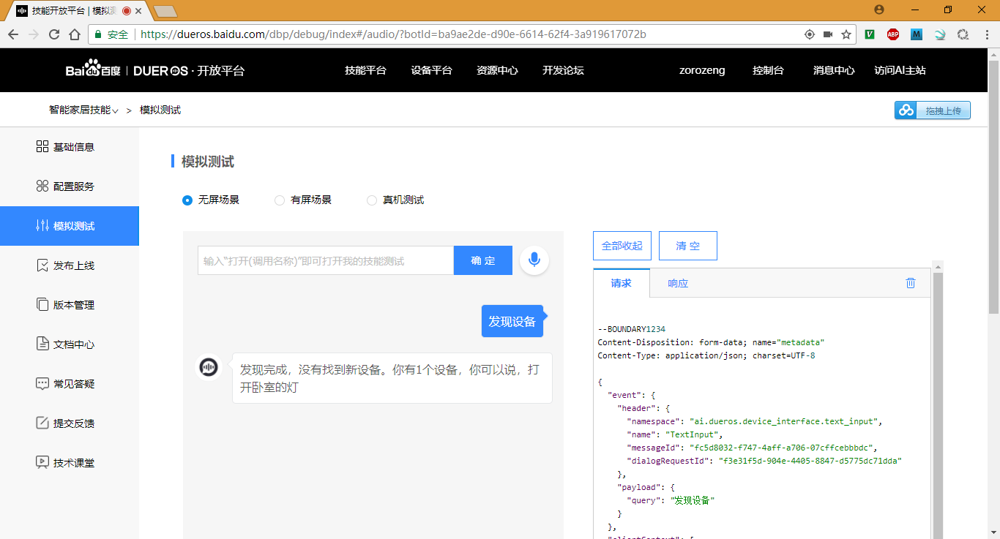
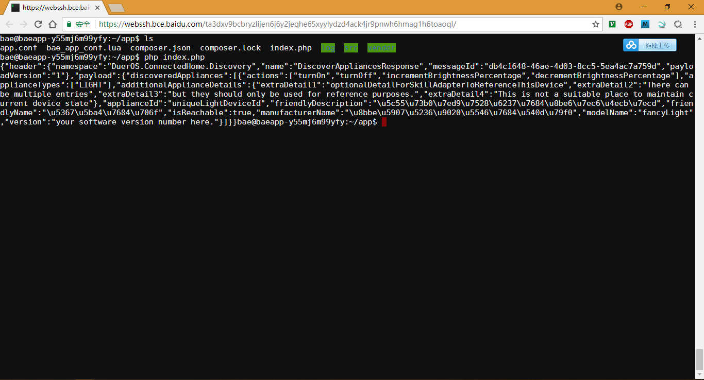
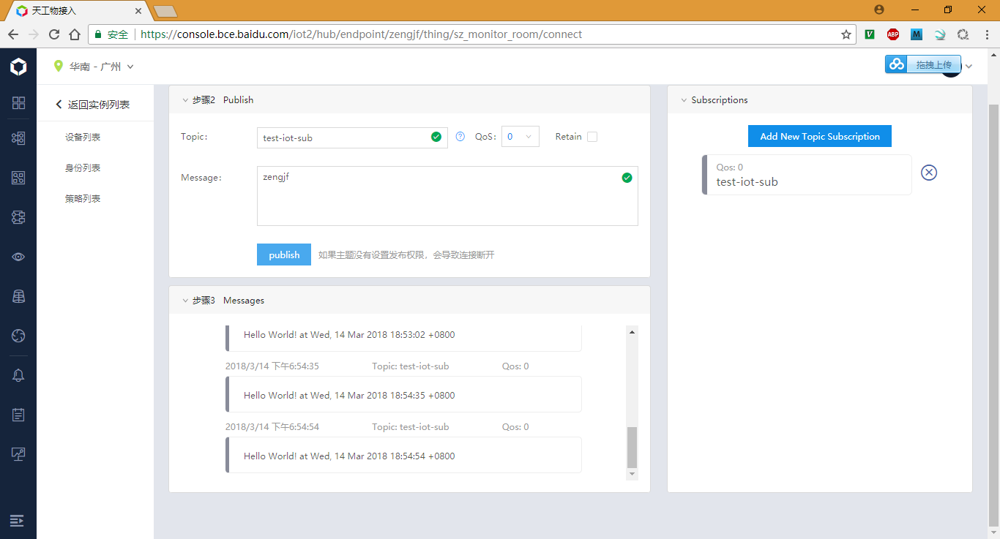

# DuerOS BAE MQTT

## PHP Package

* `composer require mcfish/libmqtt`
* `composer require dueros/bot-sdk`

软件测试采用BAE专业版本PHP 5.4版本进行测试。期间又遇到libmqtt的`client_id`不支持`-`的问题，跟踪了源代码之后才找到原因。

## Source Code

```PHP
bae@baeapp-y55mj6m99yfy:~/app$ cat index.php 
<?php
    ini_set('display_errors', 1);
    error_reporting(~0);
    require 'vendor/autoload.php';

    function logFile($type, $msg) {
        $myfile = fopen("./log/".date("Ymd").".txt", "a+");
        fwrite($myfile, $type."(".date("Ymd His").") : ".$msg."\r\n");
        fclose($myfile);
    }

    function postLog($msg) {
        logFile("require", $msg);
    }

    function responseLog($msg) {
        logFile("response", $msg);
    }

    $post_raw = file_get_contents("php://input");
    $post_json = json_decode($post_raw, true);

    postLog($post_raw);

    $server="zengjf.mqtt.iot.gz.baidubce.com";                   // change if necessary
    $port = 1883;                                                // change if necessary
    $username = "zengjf/sz_monitor_room";                        // set your username
    $password = "QE0BHFvFnIkBRIaJtPYzo3m/63Esv5fzzMr9tYVOsHo=";  // set your password
    /*
     * // Basic validation of clientid
     * if( preg_match("/[^0-9a-zA-Z]/",$clientID) ) {
     *     error_log("ClientId can only contain characters 0-9,a-z,A-Z");
     *     return;
     * }
     */
    $client_id = "DeviceIdr55efy";                               // make sure this is unique for connecting to sever - you could use uniqid()
    $mqtt = new LibMQTT\Client($server, $port, $client_id);
    $mqtt->setAuthDetails($username, $password);
    $result = $mqtt->connect(true);
    if ($result) {
        $mqtt->publish("test-iot-sub", "Hello World! at " . date("r"), 0);
        $mqtt->close();
    }

    $responseStr = " {
        \"header\": {
            \"namespace\": \"DuerOS.ConnectedHome.Discovery\",
            \"name\": \"DiscoverAppliancesResponse\",
            \"messageId\": \"".trim(shell_exec("cat /proc/sys/kernel/random/uuid"))."\",
            \"payloadVersion\": \"1\"
        },
        \"payload\": {
            \"discoveredAppliances\": [{
                \"actions\": [
                    \"turnOn\",
                    \"turnOff\",
                    \"incrementBrightnessPercentage\",
                    \"decrementBrightnessPercentage\"
                ],
                \"applianceTypes\": [
                    \"LIGHT\"
                ],
                \"additionalApplianceDetails\": {
                    \"extraDetail1\": \"optionalDetailForSkillAdapterToReferenceThisDevice\",
                    \"extraDetail2\": \"There can be multiple entries\",
                    \"extraDetail3\": \"but they should only be used for reference purposes.\",
                    \"extraDetail4\": \"This is not a suitable place to maintain current device state\"
                },
                \"applianceId\": \"uniqueLightDeviceId\",
                \"friendlyDescription\": \"展现给用户的详细介绍\",
                \"friendlyName\": \"卧室的灯\",
                \"isReachable\": true,
                \"manufacturerName\": \"设备制造商的名称\",
                \"modelName\": \"fancyLight\",
                \"version\": \"your software version number here.\"
            }]
        }
    }
    ";

    responseLog($responseStr);

    header("Content-Type: application/json");

    echo json_encode(json_decode($responseStr, true)); 
?>
bae@baeapp-y55mj6m99yfy:~/app$ 
```

## Console Test



## Web SSH Test



## IoT Hub


